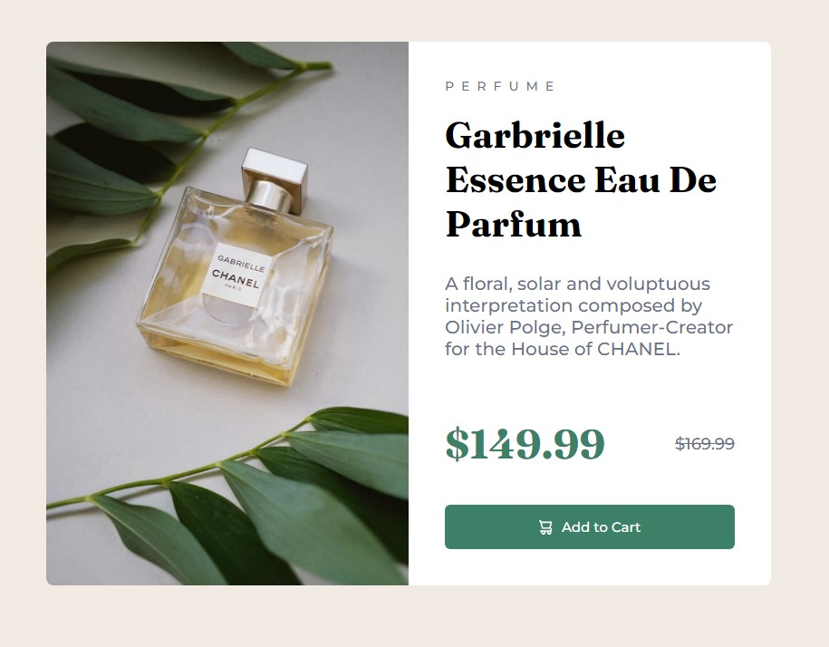

# Frontend Mentor - Product preview card component solution

This is a solution to the [Product preview card component challenge on Frontend Mentor](https://www.frontendmentor.io/challenges/product-preview-card-component-GO7UmttRfa). Frontend Mentor challenges help you improve your coding skills by building realistic projects.

## Table of contents

-   [Overview](#overview)
    -   [The challenge](#the-challenge)
    -   [Screenshot](#screenshot)
    -   [Links](#links)
-   [Second Try](#second-try)
    -   [What I learned](#what-i-learned-2)
    -   [Questions That Need Answering](#questions-that-need-answering-2)
    -   [Standard HTML Reset](#standard-html-reset)
-   [My process](#my-process)
    -   [Built with](#built-with)
    -   [What I learned](#what-i-learned)
    -   [Continued development](#continued-development)
    -   [Useful resources](#useful-resources)
-   [Author](#author)
-   [Acknowledgments](#acknowledgments)

**Note: Delete this note and update the table of contents based on what sections you keep.**

## Overview

### The challenge

Users should be able to:

-   View the optimal layout depending on their device's screen size
-   See hover and focus states for interactive elements

### Screenshot



### Links

-   Solution URL: [Github Link](https://github.com/hornjbl/product-preview-card-component-main)
-   Live Site URL: [Netlify Link](https://sweet-daffodil-334629.netlify.app/)

## Second Try

Walkthrough followed: [Taking on a Frontend Mentor challenge | Responsive Product Preview Card Component](https://www.youtube.com/watch?v=B2WL6KkqhLQ&).

### What I Learned 2

-   Every HTML page should have one (and ONLY one) `<h1>` element.
-   Every HTML page should have a `<main>` element.
-   When starting an HTML page, always start with some sort of reset in the css (see [Standard HTML Reset](#standard-html-reset)).
-   The [standard HTML reset](#standard-html-reset) also takes care of non-responsive images when changing display sizes.
-   The `<article>` element is used whenever something can be a "standalone" piece of content. In other words, this whole piece can be taken out of this project and put into a whole other site.
-   Dev tools has a mode that allows you to see the site in different sizes, including presets for various devices. (ctrl+shift+m)
-   You should use em or rem (preferrably rem) for font sizes instead of pixels.
-   In the style guide provided, there are screen width sizes provided. To which elements in the HTML should these widths be applied to? ANSWER: It seems that Kevin uses the screen size feature on DEV tools, and then puts the size to those specified in the style guide (375px for mobile), and then styles everything from there.
-   When using a flex group (like the one applied to the price elements), Kevin advises that the `flex-wrap: wrap` property be set in case the elements ever get small enough to cause wrapping issues.
-   When rounding the borders on the main container, it didn't work at first. This was because the content overflows the container element's boundaries. This can be fixed by setting the `overflow: hidden` property on the container element.
-   Locally scoped custom properties can be defined inside elements, only making it available to other elements containted by that element.
-   Remember: Use temporary borders to visually see what elements looks like and how styling affects them.
-   It's a good idea to globally reduce the line-height of bigger text elements like h1, h2 and h3 (anything bigger than 1.5rem).
-   Remember to check responsive details to the project.
-   Add to cart button: There are different ways to add the svg to the button. One way is to add the `data` attribute instead of adding the svg as an `` element.

### Questions That Need Answering 2

NOTE: After answering these questions, move them to the "What I Learned" section.

-   What are the differences between an `` and `<picture>` element? Kevin started off with an `` element, but said that he will later switch to the `<picture>` element. He then embedded the `` tag inside a `<picture>` tag.
-   Kevin made a statement that heading element identifiers shouldn't be used for styling purposes, and that a class should rather be used. Why is that?
-   Watch Kevin's playlist on [custom properties](https://www.youtube.com/playlist?list=PL4-IK0AVhVjOT2KBB5TSbD77OmfHvtqUi).
-   How do you calculate rem sizes from pixel sizes?

### Standard HTML Reset

[Josh Comeau's reset](https://www.joshwcomeau.com/css/custom-css-reset/)

```
/*
  1. Use a more-intuitive box-sizing model.
*/
*, *::before, *::after {
  box-sizing: border-box;
}
/*
  2. Remove default margin
*/
* {
  margin: 0;
}
/*
  Typographic tweaks!
  3. Add accessible line-height
  4. Improve text rendering
*/
body {
  line-height: 1.5;
  -webkit-font-smoothing: antialiased;
}
/*
  5. Improve media defaults
*/
img, picture, video, canvas, svg {
  display: block;
  max-width: 100%;
}
/*
  6. Remove built-in form typography styles
*/
input, button, textarea, select {
  font: inherit;
}
/*
  7. Avoid text overflows
*/
p, h1, h2, h3, h4, h5, h6 {
  overflow-wrap: break-word;
}
/*
  8. Create a root stacking context
*/
#root, #__next {
  isolation: isolate;
}
```

## My process

### Built with

-   Semantic HTML5 markup
-   CSS custom properties
-   Flexbox

### What I learned

Got to do my first practice-run of flexbox and its related concepts. Still need a lot of practice.

I plan on re-doing this a few times, to a) start embedding these concepts into my memory, b) get more fluent with the process, and c) see how I can incorporate some stuff learned via video links.

One of the walk-throughs I plan on watching will be [this one here](https://www.youtube.com/watch?v=B2WL6KkqhLQ) by Kevin Powell.

The approach on learning is thus as follows:

-   Try the challenge by myself.
-   Work through a walk-through, coding along.
-   Re-try the challenge, trying to incorporate lessons-learned while doing so.

<!--
Use this section to recap over some of your major learnings while working through this project. Writing these out and providing code samples of areas you want to highlight is a great way to reinforce your own knowledge.

To see how you can add code snippets, see below:

```html
<h1>Some HTML code I'm proud of</h1>
```

```css
.proud-of-this-css {
    color: papayawhip;
}
```

```js
const proudOfThisFunc = () => {
    console.log("🎉");
};
```

If you want more help with writing markdown, we'd recommend checking out [The Markdown Guide](https://www.markdownguide.org/) to learn more.-->

### Continued development

Need to work on a few things:

-   The sizing of the component. It is quite obvious that it's not the size that it's supposed to be.
-   Vertical alignment of the entire component.
-   The responsiveness of the website and compatibility with different devices and screen sizes.

<!--
Use this section to outline areas that you want to continue focusing on in future projects. These could be concepts you're still not completely comfortable with or techniques you found useful that you want to refine and perfect.-->

### Useful resources

<!-- -   [Example resource 1](https://www.example.com) - This helped me for XYZ reason. I really liked this pattern and will use it going forward.
-   [Example resource 2](https://www.example.com) - This is an amazing article which helped me finally understand XYZ. I'd recommend it to anyone still learning this concept.-->

## Author

-   Frontend Mentor - [@hornjbl](https://www.frontendmentor.io/profile/hornjbl)
-   Github - [@hornjbl](https://github.com/hornjbl)
-   Netlify - [@hornjbl](https://app.netlify.com/teams/hornjbl/overview)

## Acknowledgments

<!-- This is where you can give a hat tip to anyone who helped you out on this project. Perhaps you worked in a team or got some inspiration from someone else's solution. This is the perfect place to give them some credit. -->
